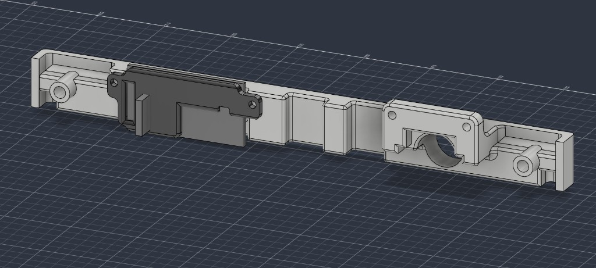

# Camera front

Thin strip that sits on the radar front, under the screen. Pick **camera only** or **camera + sound detector**.

The strip is relieved behind the middle so **UART and USB OPS** both fit on the radar front. You do not print a different camera STL for OPS connector type.

| Variant | STL | Use when |
| --- | --- | --- |
| Camera | [`Front-Camera.stl`](../../stls/camera/Front-Camera.stl) | Camera only |
| Camera + sound detector | [`Front-Camera-Sound-Detector.stl`](../../stls/camera/Front-Camera-Sound-Detector.stl) **and** [`Sound-Detector-Retainer.stl`](../../stls/camera/Sound-Detector-Retainer.stl) | Camera plus microphone / sound module. Print both. |

## Hardware

Camera module in the CAD: Innomaker OV9281. Full table: [Required hardware](../hardware.md).

| Variant | M3 inserts | M2 inserts |
| --- | --- | --- |
| Camera | 2 — case mounting | 2 — OV9281 |
| Camera + sound detector | 2 — case mounting | 4 — 2 OV9281, 2 sound-detector retainer |

**Sound detector:** seat the board in the pocket, then screw [`Sound-Detector-Retainer.stl`](../../stls/camera/Sound-Detector-Retainer.stl) over it into the two extra M2 inserts.

## Print notes

Print the camera strip with the **face on the build plate**. **Tree supports required.**

Print the retainer **flat** (the 2.5 mm plate on the bed). No supports.

